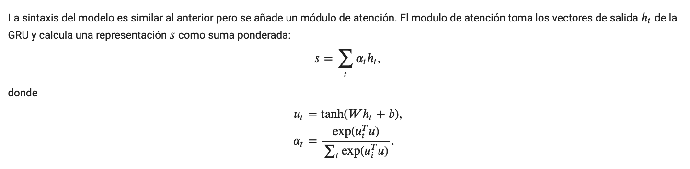
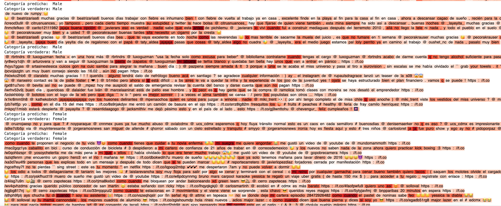

# Author profiling with attention visualization in spanish/español  
A continuación se presentan los resultados obtenidos para el problema de Author Profiling, el cual tiene el objetivo de identificar rasgos demográficos (e.g., genero, edad, nacionalidad, rasgos de personalidad, etc.) de alguna población objetivo. Para nuestro caso en particular solo nos enfocaremos en la tarea de indentificar si el conjunto de datos de perfiles de usuarios de twitter proviene de un perfil "male" o "female". Los datos fueron obtenidos de [https://pan.webis.de/clef17/pan17-web/author-profiling.html](https://pan.webis.de/clef17/pan17-web/author-profiling.html).

## Layer Attention  

## Attention Visualization  

